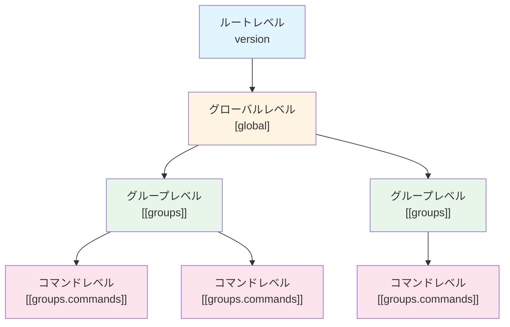

# 第2章: 設定ファイルの階層構造

## 2.1 階層の概要図

TOML 設定ファイルは以下の4つの階層で構成されます:



## 2.2 三層構造の説明

### 2.2.1 ルートレベル (version)

設定ファイルの最上位に位置し、設定ファイルのバージョン情報を保持します。

```toml
version = "1.0"
```

**役割**: 設定ファイルの互換性管理

### 2.2.2 グローバルレベル ([global])

全てのグループとコマンドに共通する設定を定義します。

```toml
[global]
timeout = 60
workdir = "/tmp/workspace"
log_level = "info"
env_allowlist = ["PATH", "HOME"]
```

**役割**: デフォルト値の提供、共通設定の一元管理

### 2.2.3 グループレベル ([[groups]])

関連するコマンドをまとめる単位です。複数のグループを定義できます。

```toml
[[groups]]
name = "backup_tasks"
description = "バックアップ関連のタスク"
priority = 1
workdir = "/var/backups"
```

**役割**: コマンドの論理的なグループ化、グループ固有の設定

### 2.2.4 コマンドレベル ([[groups.commands]])

実際に実行するコマンドを定義します。各グループ内に複数のコマンドを定義できます。

```toml
[[groups.commands]]
name = "backup_database"
description = "データベースをバックアップ"
cmd = "/usr/bin/mysqldump"
args = ["--all-databases"]
timeout = 300
```

**役割**: 実行するコマンドの詳細な指定

## 2.3 設定の継承とオーバーライドの仕組み

go-safe-cmd-runner では、下位レベルの設定が上位レベルの設定を継承・オーバーライドします。

### 2.3.1 継承の基本ルール


1. **グローバル → グループ**: グループで明示的に設定されていない項目は、グローバル設定を使用
2. **グループ → コマンド**: コマンドで明示的に設定されていない項目は、グループまたはグローバル設定を使用

### 2.3.2 オーバーライドの例

#### 例1: タイムアウトのオーバーライド

```toml
[global]
timeout = 60  # デフォルト: 60秒

[[groups]]
name = "quick_tasks"
# timeout は未指定 → グローバルの 60秒 を継承

[[groups.commands]]
name = "fast_command"
cmd = "echo"
args = ["test"]
# timeout は未指定 → グローバルの 60秒 を継承

[[groups.commands]]
name = "slow_command"
cmd = "sleep"
args = ["90"]
timeout = 120  # グローバルの 60秒 をオーバーライドして 120秒 に設定
```

#### 例2: 作業ディレクトリのオーバーライド

```toml
[global]
workdir = "/tmp"  # デフォルト作業ディレクトリ

[[groups]]
name = "log_processing"
workdir = "/var/log"  # グローバルをオーバーライド

[[groups.commands]]
name = "analyze_logs"
cmd = "grep"
args = ["ERROR", "app.log"]
# workdir は未指定 → グループの /var/log を使用
```

### 2.3.3 環境変数の継承モード

環境変数の許可リスト (`env_allowlist`) には、3つの継承モードがあります:

#### モード1: 継承モード (inherit)

グループレベルで `env_allowlist` を指定しない場合、グローバル設定を継承します。

```toml
[global]
env_allowlist = ["PATH", "HOME", "USER"]

[[groups]]
name = "inherit_group"
# env_allowlist 未指定 → グローバルの ["PATH", "HOME", "USER"] を継承
```

#### モード2: 明示モード (explicit)

グループレベルで `env_allowlist` を指定した場合、グローバル設定を無視し、指定された値のみを使用します。

```toml
[global]
env_allowlist = ["PATH", "HOME", "USER"]

[[groups]]
name = "explicit_group"
env_allowlist = ["PATH", "CUSTOM_VAR"]  # グローバルを無視してこの設定を使用
```

#### モード3: 拒否モード (reject)

グループレベルで `env_allowlist = []` と明示的に空配列を指定した場合、全ての環境変数を拒否します。

```toml
[global]
env_allowlist = ["PATH", "HOME", "USER"]

[[groups]]
name = "reject_group"
env_allowlist = []  # 全ての環境変数を拒否
```

### 2.3.4 設定の優先順位まとめ

設定項目によって、優先順位が異なります:

| 設定項目 | 優先順位 (高 → 低) | 備考 |
|---------|------------------|------|
| timeout | コマンド > グローバル | グループレベルでは設定不可 |
| workdir | グループ > グローバル | コマンドレベルでは設定不可 |
| env_allowlist | グループ > グローバル | 継承モードに応じて動作が変化 |
| verify_files | グループ + グローバル | マージされる(両方が適用) |
| log_level | グローバルのみ | 下位レベルでオーバーライド不可 |

### 2.3.5 実践例: 複雑な継承パターン

```toml
[global]
timeout = 60
workdir = "/tmp"
env_allowlist = ["PATH", "HOME", "USER"]
verify_files = ["/bin/sh"]

[[groups]]
name = "database_group"
workdir = "/var/db"              # グローバルの /tmp をオーバーライド
env_allowlist = ["PATH", "PGDATA"]  # グローバルを無視して独自の設定
verify_files = ["/usr/bin/psql"]   # グローバルの /bin/sh に追加

[[groups.commands]]
name = "db_backup"
cmd = "/usr/bin/pg_dump"
args = ["-U", "postgres"]
timeout = 300  # グローバルの 60 をオーバーライド
# workdir は未指定 → グループの /var/db を使用
# env_allowlist は未指定 → グループの ["PATH", "PGDATA"] を使用
# verify_files: グローバルの ["/bin/sh"] とグループの ["/usr/bin/psql"] がマージされる
```

この例では:
- `workdir`: グループレベルで `/var/db` にオーバーライド
- `timeout`: コマンドレベルで `300` にオーバーライド
- `env_allowlist`: グループレベルで独自の設定を使用
- `verify_files`: グローバルとグループの設定がマージされる

## 次のステップ

次章からは、各レベルの具体的なパラメータについて詳しく解説します。まずルートレベルの `version` パラメータから始めます。
