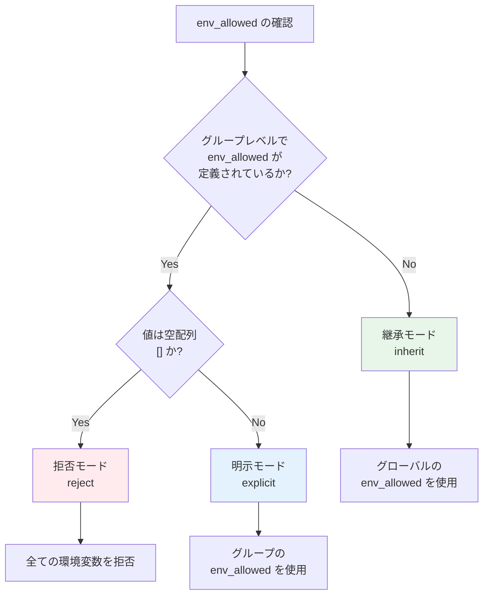

# 第5章: グループレベル設定 [[groups]]

## 概要

`[[groups]]` セクションは、関連するコマンドをまとめる論理的な単位です。各グループには名前、説明、および共通の設定を持たせることができます。設定ファイルには1つ以上のグループが必要です。

## 5.1 グループの基本設定

### 5.1.1 name - グループ名

#### 概要

グループを識別するための一意な名前を指定します。

#### 文法

```toml
[[groups]]
name = "グループ名"
```

#### パラメータの詳細

| 項目 | 内容 |
|-----|------|
| **型** | 文字列 (string) |
| **必須/オプション** | 必須 |
| **設定可能な階層** | グループのみ |
| **有効な値** | 英数字、アンダースコア、ハイフン |
| **一意性** | 設定ファイル内で一意である必要がある |

#### 役割

- **識別**: グループを一意に識別
- **ログ出力**: 実行ログでどのグループが実行されているかを表示
- **エラー報告**: エラー発生時にどのグループで問題が起きたかを特定

#### 設定例

```toml
version = "1.0"

[[groups]]
name = "database_backup"
# ...

[[groups]]
name = "log_rotation"
# ...

[[groups]]
name = "system_maintenance"
# ...
```

#### 命名のベストプラクティス

```toml
# 推奨: 明確で説明的な名前
[[groups]]
name = "daily_database_backup"

[[groups]]
name = "weekly_log_cleanup"

# 推奨しない: 不明瞭な名前
[[groups]]
name = "group1"

[[groups]]
name = "temp"
```

### 5.1.2 description - 説明

#### 概要

グループの目的や役割を説明する人間が読むためのテキストです。

#### 文法

```toml
[[groups]]
name = "example"
description = "グループの説明"
```

#### パラメータの詳細

| 項目 | 内容 |
|-----|------|
| **型** | 文字列 (string) |
| **必須/オプション** | オプション(推奨) |
| **設定可能な階層** | グループのみ |
| **有効な値** | 任意の文字列 |

#### 役割

- **ドキュメント化**: グループの目的を明確化
- **保守性向上**: 他の開発者が設定を理解しやすくする
- **ログ出力**: 実行時に表示され、何が実行されているかを理解しやすくする

#### 設定例

```toml
version = "1.0"

[[groups]]
name = "database_maintenance"
description = "データベースのバックアップと最適化を実行"

[[groups.commands]]
name = "backup"
description = "PostgreSQL データベースの完全バックアップ"
cmd = "/usr/bin/pg_dump"
args = ["mydb"]

[[groups.commands]]
name = "vacuum"
description = "データベースの最適化(VACUUM ANALYZE)"
cmd = "/usr/bin/psql"
args = ["-c", "VACUUM ANALYZE"]
```

## 5.2 リソース管理設定

### 5.2.1 ❌ temp_dir - 一時ディレクトリ（廃止済み）

#### ⚠️ 廃止通知

**この機能は廃止されました。** グループレベルでの `temp_dir` フィールドはサポートされなくなりました。

#### 新しい仕様での代替方法

`temp_dir` フィールドは削除され、より簡潔な仕様に変更されました：

1. **自動一時ディレクトリ（デフォルト）**: `workdir` を指定しない場合、自動的に一時ディレクトリが生成されます
2. **固定ディレクトリ**: `workdir` を指定した場合、その固定ディレクトリが使用されます
3. **`__runner_workdir` 変数**: 実行時のワークディレクトリを参照できる予約変数が利用可能です

#### マイグレーション例

```toml
# 旧仕様（エラーになります）
[[groups]]
name = "data_processing"
temp_dir = true  # ❌ 削除する必要があります

# 新仕様（自動一時ディレクトリ）
[[groups]]
name = "data_processing"
# workdir未指定 - 自動的に一時ディレクトリが生成される

[[groups.commands]]
name = "download_data"
cmd = "wget"
args = ["https://example.com/data.csv", "-O", "%{__runner_workdir}/data.csv"]
# ✅ __runner_workdir変数で一時ディレクトリを参照
```

### 5.2.2 workdir - 作業ディレクトリ

#### 概要

グループ内の全コマンドが実行される作業ディレクトリを指定します。指定しない場合は自動的に一時ディレクトリが生成されます。

#### 文法

```toml
[[groups]]
name = "example"
workdir = "ディレクトリパス"  # オプション
```

#### パラメータの詳細

| 項目 | 内容 |
|-----|------|
| **型** | 文字列 (string) |
| **必須/オプション** | オプション |
| **設定可能な階層** | グループ、コマンド |
| **デフォルト値** | 自動生成された一時ディレクトリ |
| **有効な値** | 絶対パス |
| **オーバーライド** | コマンドレベルでオーバーライド可能 |

#### 新機能: 自動一時ディレクトリ

**デフォルト動作（推奨）**: `workdir` を指定しない場合

```toml
[[groups]]
name = "backup"
# workdir未指定 → 自動的に一時ディレクトリが生成

[[groups.commands]]
name = "create_backup"
cmd = "tar"
args = ["-czf", "%{__runner_workdir}/backup.tar.gz", "/etc"]
# 一時ディレクトリに backup.tar.gz が作成される
```

**一時ディレクトリの特徴**:
- パス: `/tmp/scr-<グループ名>-<ランダム文字列>`
- 権限: 0700（所有者のみアクセス可能）
- 自動削除: グループ実行終了後に削除（`--keep-temp-dirs` フラグで保持可能）

#### 設定例

**固定ディレクトリを使用する場合**:

```toml
[[groups]]
name = "log_analysis"
workdir = "/var/log"  # 固定作業ディレクトリを指定

[[groups.commands]]
name = "grep_errors"
cmd = "grep"
args = ["ERROR", "app.log"]
# /var/log/app.log から検索
```

**自動一時ディレクトリを使用する場合（推奨）**:

```toml
[[groups]]
name = "backup"
# workdir未指定 → 自動的に一時ディレクトリが生成

[[groups.commands]]
name = "create_backup"
cmd = "tar"
args = ["-czf", "%{__runner_workdir}/backup.tar.gz", "/etc"]
# 自動生成された一時ディレクトリに backup.tar.gz を作成
```

#### 実行時のディレクトリパス取得

`__runner_workdir` 予約変数を使用して、実行時のワークディレクトリパスを取得できます：

```toml
[[groups]]
name = "data_processing"

[[groups.commands]]
name = "show_workdir"
cmd = "echo"
args = ["Current working directory: %{__runner_workdir}"]

[[groups.commands]]
name = "create_output"
cmd = "touch"
args = ["%{__runner_workdir}/output.txt"]
```

## 5.3 セキュリティ設定

### 5.3.1 verify_files - ファイル検証(グループレベル)

#### 概要

グループ固有のファイル検証リストを指定します。グローバルレベルの `verify_files` に追加されます(マージ)。

#### 文法

```toml
[[groups]]
name = "example"
verify_files = ["ファイルパス1", "ファイルパス2", ...]
```

#### パラメータの詳細

| 項目 | 内容 |
|-----|------|
| **型** | 文字列配列 (array of strings) |
| **必須/オプション** | オプション |
| **設定可能な階層** | グローバル、グループ |
| **デフォルト値** | [] |
| **有効な値** | 絶対パスのリスト |
| **マージ動作** | グローバル設定とマージされる |

#### 設定例

```toml
version = "1.0"

[global]
verify_files = ["/bin/sh"]  # 全グループで検証

[[groups]]
name = "database_tasks"
verify_files = [
    "/usr/bin/psql",
    "/usr/bin/pg_dump",
]  # このグループでは /bin/sh, /usr/bin/psql, /usr/bin/pg_dump を検証

[[groups.commands]]
name = "backup"
cmd = "/usr/bin/pg_dump"
args = ["mydb"]

[[groups]]
name = "web_tasks"
verify_files = [
    "/usr/bin/curl",
    "/usr/bin/wget",
]  # このグループでは /bin/sh, /usr/bin/curl, /usr/bin/wget を検証

[[groups.commands]]
name = "fetch_data"
cmd = "/usr/bin/curl"
args = ["https://example.com/data"]
```

### 5.3.2 vars - グループ内部変数

#### 概要

グループレベルで内部変数を定義します。グローバルの `vars` とマージされ、グループ内の全コマンドから参照可能です。

#### 文法

```toml
[[groups]]
name = "example"
vars = ["var1=value1", "var2=value2", ...]
```

#### パラメータの詳細

| 項目 | 内容 |
|-----|------|
| **型** | 文字列配列 (array of strings) |
| **必須/オプション** | オプション |
| **設定可能な階層** | グローバル、グループ、コマンド |
| **デフォルト値** | [] (変数なし) |
| **書式** | `"変数名=値"` 形式 |
| **参照構文** | `%{変数名}` |
| **継承動作** | Global.vars とマージ(Group が優先) |

#### 役割

- **グループ固有の設定**: グループ専用の内部変数を定義
- **Global vars の拡張**: グローバル変数を上書きまたは追加
- **スコープ管理**: グループ内のコマンドからのみ参照可能

#### 設定例

#### 例1: グローバル変数の上書き

```toml
version = "1.0"

[global]
vars = [
    "app_dir=/opt/myapp",
    "log_level=info"
]

[[groups]]
name = "debug_group"
vars = [
    "log_level=debug"  # グローバルの log_level を上書き
]

[[groups.commands]]
name = "run_debug"
cmd = "%{app_dir}/bin/app"
args = ["--log-level", "%{log_level}"]
# 実際: /opt/myapp/bin/app --log-level debug
```

#### 例2: グループ固有の変数追加

```toml
version = "1.0"

[global]
vars = ["base_dir=/opt"]

[[groups]]
name = "web_group"
vars = [
    "web_root=%{base_dir}/www",
    "port=8080"
]

[[groups.commands]]
name = "start_web"
cmd = "/usr/bin/nginx"
args = ["-c", "%{web_root}/nginx.conf", "-g", "daemon off;"]
env_vars = ["PORT=%{port}"]
```

#### 例3: 環境別設定

```toml
version = "1.0"

[global]
vars = ["app_dir=/opt/myapp"]

[[groups]]
name = "production"
vars = [
    "env_type=prod",
    "config_file=%{app_dir}/config/%{env_type}.yml",
    "db_host=prod-db.example.com"
]

[[groups.commands]]
name = "run_prod"
cmd = "%{app_dir}/bin/app"
args = ["--config", "%{config_file}", "--db-host", "%{db_host}"]

[[groups]]
name = "development"
vars = [
    "env_type=dev",
    "config_file=%{app_dir}/config/%{env_type}.yml",
    "db_host=localhost"
]

[[groups.commands]]
name = "run_dev"
cmd = "%{app_dir}/bin/app"
args = ["--config", "%{config_file}", "--db-host", "%{db_host}"]
```

### 5.3.3 from_env - システム環境変数の取り込み(グループレベル)

#### 概要

グループレベルでシステム環境変数を内部変数として取り込みます。**Merge(マージ)方式**で、グループが `from_env` を定義すると Global.from_env と統合されます。

#### 文法

```toml
[[groups]]
name = "example"
env_import = ["内部変数名=システム環境変数名", ...]
```

#### パラメータの詳細

| 項目 | 内容 |
|-----|------|
| **型** | 文字列配列 (array of strings) |
| **必須/オプション** | オプション |
| **設定可能な階層** | グローバル、グループ |
| **デフォルト値** | nil (Global.from_env を継承) |
| **書式** | `"内部変数名=システム環境変数名"` 形式 |
| **継承動作** | **Merge(マージ)方式** |

#### 継承ルール(Merge方式)

| Group.from_env の状態 | 動作 |
|---------------------|------|
| **未定義(nil)** | Global.from_env を継承 |
| **空配列 `[]`** | Global.from_env を継承 |
| **定義あり** | Global.from_env + Group.from_env をマージ（同名は Group が優先） |

#### 設定例

#### 例1: Global.from_env の継承

```toml
version = "1.0"

[global]
env_allowed = ["HOME", "USER"]
from_env_vars = [
    "home=HOME",
    "username=USER"
]

[[groups]]
name = "inherit_group"
# from_env 未定義 → Global.from_env を継承

[[groups.commands]]
name = "show_home"
cmd = "/bin/echo"
args = ["Home: %{home}, User: %{username}"]
# home と username が利用可能
```

#### 例2: Global.from_env とマージ

```toml
version = "1.0"

[global]
env_allowed = ["HOME", "USER", "PATH"]
from_env_vars = [
    "home=HOME",
    "user=USER"
]

[[groups]]
name = "merge_group"
from_env_vars = [
    "path=PATH"  # Global.from_env と統合（マージ）
]

[[groups.commands]]
name = "show_all"
cmd = "/bin/echo"
args = ["Home: %{home}, User: %{user}, Path: %{path}"]
# home、user、path が全て利用可能
```

#### 例3: 同名変数の上書き

```toml
version = "1.0"

[global]
env_allowed = ["HOME", "USER", "HOSTNAME"]
from_env_vars = [
    "home=HOME",
    "user=USER"
]

[[groups]]
name = "override_merge_group"
from_env_vars = [
    "home=CUSTOM_HOME_DIR",  # home を上書き
    "host=HOSTNAME"           # 新しい変数を追加
]

[[groups.commands]]
name = "show_info"
cmd = "/bin/echo"
args = ["Home: %{home}, User: %{user}, Host: %{host}"]
# home は CUSTOM_HOME_DIR から、user は global から、host は group から取得
```

#### 例4: 空配列でも Global を継承

```toml
version = "1.0"

[global]
env_allowed = ["HOME"]
from_env_vars = ["home=HOME"]

[[groups]]
name = "empty_merge_group"
from_env_vars = []  # 空配列: Global.from_env を継承（Merge方式）

[[groups.commands]]
name = "show_home"
cmd = "/bin/echo"
args = ["Home: %{home}"]
# home は利用可能
```

#### 重要な注意点

**Merge方式の利点**: グループで新しい変数を追加しながら、Global で定義した共通の変数も自動的に継承できます。これにより、設定の重複を避けながら、必要に応じた拡張が可能です。

### 5.3.4 env_allowed - 環境変数許可リスト(グループレベル)

#### 概要

グループレベルで `from_env` によるシステム環境変数の取り込みを制御します。**Override(上書き)方式**で動作します。

#### 文法

```toml
[[groups]]
name = "example"
env_allowed = ["変数1", "変数2", ...]
```

#### パラメータの詳細

| 項目 | 内容 |
|-----|------|
| **型** | 文字列配列 (array of strings) |
| **必須/オプション** | オプション |
| **設定可能な階層** | グローバル、グループ |
| **デフォルト値** | nil (Global.env_allowed を継承) |
| **有効な値** | 環境変数名のリスト、または空配列 |
| **継承動作** | **Override(上書き)方式** |

### 5.3.5 env - グループプロセス環境変数

#### 概要

そのグループ内の全てのコマンドで共通して使用するプロセス環境変数を定義します。グローバルレベルの環境変数とマージされ、子プロセスに渡されます。内部変数 `%{VAR}` を値に使用できます。

#### 文法

```toml
[[groups]]
name = "example"
env_vars = ["KEY1=value1", "KEY2=value2", ...]
```

#### パラメータの詳細

| 項目 | 内容 |
|-----|------|
| **型** | 文字列配列 (array of strings) |
| **必須/オプション** | オプション |
| **設定可能な階層** | グローバル、グループ、コマンド |
| **デフォルト値** | [] (環境変数なし) |
| **書式** | `"KEY=VALUE"` 形式 |
| **値での変数展開** | 内部変数 `%{VAR}` を使用可能 |
| **マージ動作** | Global.env とマージ(Group が優先) |

#### 役割

- **グループ固有の設定**: そのグループに特有のプロセス環境変数を定義
- **内部変数の活用**: `%{VAR}` 形式で内部変数を参照可能
- **グローバル設定の上書き**: グローバルレベルの環境変数を変更
- **コマンド間の共有**: グループ内の全コマンドで設定を共有

#### 設定例

##### 例1: グループ固有の環境変数と内部変数の活用

```toml
version = "1.0"

[global]
vars = ["base_dir=/opt/app"]
env_vars = ["LOG_LEVEL=info"]

[[groups]]
name = "database_group"
vars = [
    "db_data=%{base_dir}/db-data"
]
env_vars = [
    "DB_HOST=localhost",
    "DB_PORT=5432",
    "DB_DATA=%{db_data}"  # 内部変数を参照
]

[[groups.commands]]
name = "connect"
cmd = "/usr/bin/psql"
args = ["-h", "${DB_HOST}", "-p", "${DB_PORT}"]
# DB_HOST と DB_PORT は Group.env から取得
```

##### 例2: グローバル設定の上書き

```toml
version = "1.0"

[global]
env_vars = [
    "LOG_LEVEL=info",
    "ENV_TYPE=production",
]

[[groups]]
name = "development_group"
env_vars = [
    "LOG_LEVEL=debug",      # Global.env の LOG_LEVEL を上書き
    "ENV_TYPE=development", # Global.env の ENV_TYPE を上書き
]

[[groups.commands]]
name = "run_dev"
cmd = "/opt/app/bin/app"
args = ["--log-level", "${LOG_LEVEL}"]
# LOG_LEVEL=debug が使用される
```

##### 例3: グループ内の変数参照

```toml
version = "1.0"

[global]
env_vars = ["APP_ROOT=/opt/myapp"]

[[groups]]
name = "web_group"
env_vars = [
    "WEB_DIR=${APP_ROOT}/web",         # Global.env の APP_ROOT を参照
    "STATIC_DIR=${WEB_DIR}/static",    # Group.env の WEB_DIR を参照
    "UPLOAD_DIR=${WEB_DIR}/uploads",   # Group.env の WEB_DIR を参照
]

[[groups.commands]]
name = "start_server"
cmd = "${WEB_DIR}/server"
args = ["--static", "${STATIC_DIR}", "--upload", "${UPLOAD_DIR}"]
```

#### 優先順位

環境変数は以下の優先順位で解決されます：

1. システム環境変数（最低優先）
2. Global.env（グローバル環境変数）
3. **Group.env**（グループ環境変数）← このセクション
4. Command.env（コマンド環境変数）（最高優先）

```toml
[global]
env_vars = ["SHARED=global", "OVERRIDE=global"]

[[groups]]
name = "example"
env_vars = ["OVERRIDE=group", "GROUP_ONLY=group"]  # OVERRIDE を上書き

[[groups.commands]]
name = "cmd1"
env_vars = ["OVERRIDE=command"]  # さらに上書き

# 実行時の環境変数:
# SHARED=global
# OVERRIDE=command
# GROUP_ONLY=group
```

#### 変数展開

Group.env 内では、Global.env で定義した変数や、同じ Group.env 内の他の変数を参照できます。

##### Global.env の変数を参照

```toml
[global]
env_vars = ["BASE=/opt/app"]

[[groups]]
name = "services"
env_vars = [
    "SERVICE_DIR=${BASE}/services",     # Global.env の BASE を参照
    "CONFIG=${SERVICE_DIR}/config",     # Group.env の SERVICE_DIR を参照
]
```

##### システム環境変数の参照

```toml
[global]
env_allowed = ["HOME", "USER"]

[[groups]]
name = "user_specific"
env_vars = [
    "USER_DATA=${HOME}/${USER}/data",  # システム環境変数 HOME と USER を参照
]
```

#### 注意事項

##### 1. KEY名の制約

Global.env と同じ制約が適用されます（第4章参照）。

##### 2. 重複定義

同じグループ内で同じKEYを複数回定義するとエラーになります。

##### 3. allowlist との関係

Group.env で定義した変数がシステム環境変数を参照する場合、そのグループの `env_allowed` に参照先の変数を追加する必要があります。

```toml
[global]
env_allowed = ["PATH"]

[[groups]]
name = "example"
env_vars = ["MY_HOME=${HOME}/app"]  # HOME を参照
env_allowed = ["HOME"]       # 必須: HOME を許可（グローバルを上書き）
```

##### 4. グループ間の独立性

Group.env で定義した変数は、そのグループ内でのみ有効です。他のグループには影響しません。

```toml
[[groups]]
name = "group1"
env_vars = ["VAR=value1"]

[[groups.commands]]
name = "cmd1"
cmd = "/bin/echo"
args = ["${VAR}"]  # value1

[[groups]]
name = "group2"
# env で VAR を定義していない

[[groups.commands]]
name = "cmd2"
cmd = "/bin/echo"
args = ["${VAR}"]  # エラー: VAR は未定義
```

#### ベストプラクティス

1. **グループ固有の設定を定義**: グループに特有の環境変数は Group.env に
2. **Global.env との連携**: ベースパスは Global.env、派生パスは Group.env
3. **適切な allowlist 設定**: システム環境変数を参照する場合は allowlist を設定
4. **明確な命名**: グループ固有であることがわかる変数名を使用

```toml
# 推奨される構成
[global]
env_vars = [
    "APP_ROOT=/opt/myapp",
    "ENV_TYPE=production",
]
env_allowed = ["HOME", "PATH"]

[[groups]]
name = "database"
env_vars = [
    "DB_HOST=localhost",              # グループ固有
    "DB_PORT=5432",                   # グループ固有
    "DB_DATA=${APP_ROOT}/db-data",    # Global.env を参照
]

[[groups]]
name = "web"
env_vars = [
    "WEB_DIR=${APP_ROOT}/web",        # Global.env を参照
    "PORT=8080",                      # グループ固有
]
```

### 5.3.6 cmd_allowed - グループレベルコマンド許可リスト

#### 概要

この特定のグループ内でのみ実行を許可する追加コマンドを指定します。ハードコードされたグローバルパターンでカバーされないグループ固有のツールを許可できます。

#### 文法

```toml
[[groups]]
name = "example"
cmd_allowed = ["/path/to/command1", "%{variable}/command2", ...]
```

#### パラメータの詳細

| 項目 | 内容 |
|-----|------|
| **型** | 文字列配列（絶対パス）|
| **必須/オプション** | オプション |
| **設定可能な階層** | グループのみ |
| **デフォルト値** | [] (追加コマンドなし) |
| **有効な値** | 絶対パスのリスト（変数展開をサポート）|
| **検証** | パスは存在し、解決可能である必要がある |

#### 役割

- **グループ固有の権限**: 特定のグループ内でのみコマンドを許可
- **セキュリティ分離**: カスタムツールを必要な場所でのみ利用可能に
- **柔軟性**: グローバルパターンと組み合わせてきめ細かい制御

#### ハードコードされたグローバルパターンとの関係

以下のグローバルパターンがハードコードされています（TOMLで設定不可）：
```
^/bin/.*
^/usr/bin/.*
^/usr/sbin/.*
^/usr/local/bin/.*
```

コマンドは以下の**いずれか**にマッチすれば許可されます：
1. 上記のハードコードされたグローバルパターン（正規表現マッチング）
2. グループ `cmd_allowed` のいずれかの完全パス（変数展開とシンボリックリンク解決後）

これは**OR条件**であり、AND条件ではありません。

#### 設定例

##### 例1: 基本的なグループ固有コマンド

```toml
version = "1.0"

# グローバルパターン（^/bin/.*, ^/usr/bin/.* 等）はハードコードされており
# TOMLで設定する必要はありません

[[groups]]
name = "custom_build"
# このグループでのみカスタムツールを許可
cmd_allowed = ["/opt/myproject/bin/build_tool"]

[[groups.commands]]
name = "run_build"
cmd = "/opt/myproject/bin/build_tool"  # cmd_allowed 経由で許可
args = ["--release"]

[[groups.commands]]
name = "run_sh"
cmd = "/bin/sh"  # ハードコードされたグローバルパターン経由で許可
args = ["-c", "echo 'ビルド完了'"]
```

##### 例2: 変数展開付き

```toml
version = "1.0"

[global]
env_import = ["home=HOME"]
vars = ["tools_dir=/opt/tools"]

[[groups]]
name = "user_scripts"
cmd_allowed = [
    "%{home}/bin/my_script.sh",    # /home/user/bin/my_script.sh に展開
    "%{tools_dir}/processor",      # /opt/tools/processor に展開
]

[[groups.commands]]
name = "run_user_script"
cmd = "%{home}/bin/my_script.sh"
args = ["--verbose"]
```

##### 例3: 異なる権限を持つ複数グループ

```toml
version = "1.0"

# グローバルパターンはハードコードされています

[[groups]]
name = "database_admin"
cmd_allowed = [
    "/opt/db-tools/backup",
    "/opt/db-tools/restore",
]

[[groups.commands]]
name = "backup_db"
cmd = "/opt/db-tools/backup"
args = ["--all"]

[[groups]]
name = "web_deploy"
cmd_allowed = [
    "/opt/deploy/push",
    "/opt/deploy/rollback",
]

[[groups.commands]]
name = "deploy_app"
cmd = "/opt/deploy/push"
args = ["--env=production"]

[[groups]]
name = "monitoring"
# cmd_allowed なし - ハードコードされたグローバルパターンのみ適用

[[groups.commands]]
name = "check_status"
cmd = "/usr/bin/curl"  # ハードコードされたパターン経由で許可
args = ["http://localhost/health"]
```

#### セキュリティ機能

##### 1. 絶対パス必須

パストラバーサル攻撃を防ぐため、相対パスは拒否されます。

```toml
[[groups]]
cmd_allowed = ["./script.sh"]  # エラー: 相対パスは許可されない
cmd_allowed = ["../bin/tool"]  # エラー: 相対パスは許可されない
cmd_allowed = ["/opt/bin/tool"]  # 正しい
```

##### 2. パス存在検証

設定読み込み時にパスが存在する必要があります。存在しないパスはエラーになります。

```toml
[[groups]]
cmd_allowed = ["/nonexistent/path"]  # エラー: パスが存在しない
```

##### 3. シンボリックリンク解決

`cmd_allowed` 内のシンボリックリンクは実際のパスに解決されます。コマンドは解決後のパスに対してマッチングされます。

```toml
# /usr/local/bin/python -> /usr/bin/python3 の場合
[[groups]]
cmd_allowed = ["/usr/local/bin/python"]  # /usr/bin/python3 として保存
```

#### 注意事項

##### 1. 他のセキュリティチェックは継続

`cmd_allowed` でコマンドが許可されていても、他のセキュリティ検証は継続されます：
- ファイル整合性検証（ハッシュチェック）
- リスク評価
- 権限検証
- 環境変数検証

##### 2. 変数展開のタイミング

`cmd_allowed` 内の変数は設定読み込み時ではなく、グループの実行準備時に展開されます。これにより実行時変数を使用できます。

##### 3. ベストプラクティス

- **最小権限の原則**: グループの目的に必要なコマンドのみ追加
- **移植性のための変数使用**: ハードコードされたパスではなく適切な場所で `%{home}` を使用
- **目的を文書化**: 各コマンドが許可されている理由をコメントで説明

```toml
[[groups]]
name = "deployment"
cmd_allowed = [
    "/opt/deploy/push",      # 本番デプロイに必要
    "/opt/deploy/rollback",  # 緊急ロールバック機能
]
```

#### 次のステップ

- **Command.env**: コマンドレベルの環境変数については第6章を参照
- **変数展開の詳細**: 変数展開の仕組みについては第7章を参照
- **環境変数継承モード**: allowlist の継承については5.4節を参照

## 5.4 環境変数継承モード

環境変数の許可リスト(`env_allowed`)には、3つの継承モードがあります。これは go-safe-cmd-runner の重要な機能の一つです。

### 5.4.1 継承モード (inherit)

#### 動作

グループレベルで `env_allowed` を**指定しない**場合、グローバルの設定を継承します。

#### 使用シーン

- グローバル設定で十分な場合
- 複数のグループで同じ環境変数を使用する場合

#### 設定例

```toml
version = "1.0"

[global]
env_allowed = ["PATH", "HOME", "USER"]

[[groups]]
name = "inherit_group"
# env_allowed を指定しない → グローバルを継承

[[groups.commands]]
name = "show_env"
cmd = "printenv"
args = []
# PATH, HOME, USER が利用可能
```

### 5.4.2 明示モード (explicit)

#### 動作

グループレベルで `env_allowed` に**具体的な値**を指定した場合、グローバル設定を無視し、指定された値のみを使用します。

#### 使用シーン

- グループ固有の環境変数セットが必要な場合
- グローバル設定とは異なる制限を設けたい場合

#### 設定例

```toml
version = "1.0"

[global]
env_allowed = ["PATH", "HOME", "USER"]

[[groups]]
name = "explicit_group"
env_allowed = ["PATH", "DATABASE_URL", "API_KEY"]  # グローバルを無視

[[groups.commands]]
name = "run_app"
cmd = "/opt/app/bin/app"
args = []
env_vars = [
    "DATABASE_URL=postgresql://localhost/mydb",
    "API_KEY=secret123",
]
# PATH, DATABASE_URL, API_KEY のみが利用可能
# HOME, USER は利用不可
```

### 5.4.3 拒否モード (reject)

#### 動作

グループレベルで `env_allowed = []` と**空の配列**を明示的に指定した場合、全ての環境変数を拒否します。

#### 使用シーン

- 完全に隔離された環境でコマンドを実行したい場合
- セキュリティ要件が非常に高い場合

#### 設定例

```toml
version = "1.0"

[global]
env_allowed = ["PATH", "HOME", "USER"]

[[groups]]
name = "reject_group"
env_allowed = []  # 全ての環境変数を拒否

[[groups.commands]]
name = "isolated_command"
cmd = "/bin/echo"
args = ["完全に隔離された実行"]
# 環境変数なしで実行される
```

### 5.4.4 継承モードの判定ルール

モードの判定は以下のロジックで行われます:



#### 例: 3つのモードの比較

```toml
version = "1.0"

[global]
env_allowed = ["PATH", "HOME", "USER"]

# モード1: 継承モード
[[groups]]
name = "group_inherit"
# env_allowed 未指定
# 結果: PATH, HOME, USER が利用可能

[[groups.commands]]
name = "test1"
cmd = "printenv"
args = ["HOME"]  # HOME が出力される

# モード2: 明示モード
[[groups]]
name = "group_explicit"
env_allowed = ["PATH", "CUSTOM_VAR"]
# 結果: PATH, CUSTOM_VAR のみが利用可能(HOME, USER は不可)

[[groups.commands]]
name = "test2"
cmd = "printenv"
args = ["HOME"]  # エラー: HOME は許可されていない

[[groups.commands]]
name = "test3"
cmd = "printenv"
args = ["CUSTOM_VAR"]
env_vars = ["CUSTOM_VAR=value"]  # CUSTOM_VAR が出力される

# モード3: 拒否モード
[[groups]]
name = "group_reject"
env_allowed = []
# 結果: 全ての環境変数が拒否される

[[groups.commands]]
name = "test4"
cmd = "printenv"
args = ["PATH"]  # エラー: PATH も許可されていない
```

### 実践的な使用例

#### 例1: セキュリティレベルに応じた設定

```toml
version = "1.0"

[global]
env_allowed = ["PATH", "HOME", "USER"]

# 通常のタスク: グローバルを継承
[[groups]]
name = "normal_tasks"
# env_allowed 未指定 → 継承モード

[[groups.commands]]
name = "backup"
cmd = "/usr/bin/backup.sh"
args = []

# 機密データ処理: 最小限の環境変数
[[groups]]
name = "sensitive_data"
env_allowed = ["PATH"]  # PATH のみ許可 → 明示モード

[[groups.commands]]
name = "process_sensitive"
cmd = "/opt/secure/process"
args = []

# 完全隔離タスク: 環境変数なし
[[groups]]
name = "isolated_tasks"
env_allowed = []  # 全て拒否 → 拒否モード

[[groups.commands]]
name = "isolated_check"
cmd = "/bin/echo"
args = ["完全隔離"]
```

#### 例2: 環境ごとの設定

```toml
version = "1.0"

[global]
env_allowed = ["PATH", "HOME"]

# 開発環境グループ
[[groups]]
name = "development"
env_allowed = [
    "PATH",
    "HOME",
    "DEBUG_MODE",
    "DEV_DATABASE_URL",
]  # 明示モード: 開発用変数を追加

[[groups.commands]]
name = "dev_server"
cmd = "/opt/app/server"
args = []
env_vars = ["DEBUG_MODE=true", "DEV_DATABASE_URL=postgresql://localhost/dev"]

# 本番環境グループ
[[groups]]
name = "production"
env_allowed = [
    "PATH",
    "PROD_DATABASE_URL",
]  # 明示モード: 本番用変数のみ

[[groups.commands]]
name = "prod_server"
cmd = "/opt/app/server"
args = []
env_vars = ["PROD_DATABASE_URL=postgresql://prod-server/prod"]
```

## グループ設定の全体例

以下は、グループレベルの設定を組み合わせた実践的な例です:

```toml
version = "1.0"

[global]
timeout = 300
workdir = "/tmp"
env_allowed = ["PATH", "HOME", "USER"]
verify_files = ["/bin/sh"]

# グループ1: データベースバックアップ
[[groups]]
name = "database_backup"
description = "PostgreSQL データベースの日次バックアップ"
workdir = "/var/backups/db"
verify_files = ["/usr/bin/pg_dump", "/usr/bin/psql"]
env_allowed = ["PATH", "PGDATA", "PGHOST"]

[[groups.commands]]
name = "backup_main_db"
description = "メインデータベースのバックアップ"
cmd = "/usr/bin/pg_dump"
args = ["-U", "postgres", "maindb"]
output_file = "maindb_backup.sql"
timeout = 600

# グループ2: ログローテーション
[[groups]]
name = "log_rotation"
description = "古いログファイルの圧縮と削除"
workdir = "/var/log/app"
env_allowed = ["PATH"]  # 明示モード: PATH のみ

[[groups.commands]]
name = "compress_old_logs"
cmd = "gzip"
args = ["app.log.1"]

[[groups.commands]]
name = "delete_ancient_logs"
cmd = "find"
args = [".", "-name", "*.log.gz", "-mtime", "+30", "-delete"]

# グループ3: 一時ファイル処理
[[groups]]
name = "temp_processing"
description = "一時ディレクトリでのデータ処理"
# workdir未指定 - 自動的に一時ディレクトリが生成される
env_allowed = []  # 拒否モード: 環境変数なし

[[groups.commands]]
name = "create_temp_data"
cmd = "echo"
args = ["Temporary data"]
output_file = "temp_data.txt"

[[groups.commands]]
name = "process_temp_data"
cmd = "cat"
args = ["temp_data.txt"]
```

## 次のステップ

次章では、コマンドレベルの設定(`[[groups.commands]]`)について詳しく解説します。実際に実行するコマンドの詳細な設定方法を学びます。
