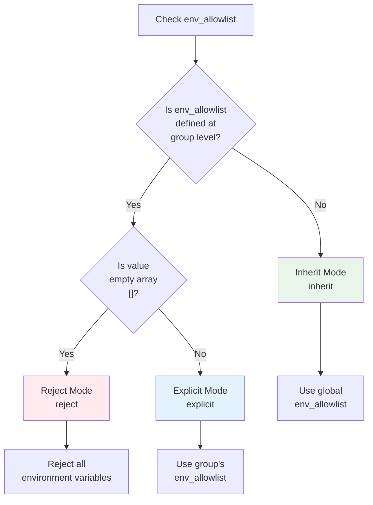

# Chapter 5: Group Level Configuration [[groups]]

## Overview

The `[[groups]]` section is a logical unit that groups related commands. Each group can have a name, description, and common settings. The configuration file requires one or more groups.

## 5.1 Basic Group Settings

### 5.1.1 name - Group Name

#### Overview

Specifies a unique name to identify the group.

#### Syntax

```toml
[[groups]]
name = "group_name"
```

#### Parameter Details

| Item | Description #### Inheritance Behavior** | Three modes (described below) |

### 5.3.3 env - Group Environment Variables

#### Overview

Defines environment variables that are commonly used by all commands within that group. Can override global-level environment variables.

#### Syntax

```toml
[[groups]]
name = "example"
env = ["KEY1=value1", "KEY2=value2", ...]
```

#### Parameter Details

| Item | Description |
|------|-------------|
| **Type** | Array of strings (array of strings) |
| **Required/Optional** | Optional |
| **Configurable Level** | Global, Group, Command |
| **Default Value** | [] (no environment variables) |
| **Format** | `"KEY=VALUE"` format |
| **Override** | Same-name variables can be overridden at command level |

#### Role

- **Group-Specific Settings**: Define environment variables specific to that group
- **Override Global Settings**: Change global-level environment variables
- **Share Between Commands**: Share settings across all commands in the group

#### Configuration Examples

##### Example 1: Group-Specific Environment Variables

```toml
version = "1.0"

[global]
env = [
    "BASE_DIR=/opt/app",
    "LOG_LEVEL=info",
]
env_allowlist = ["HOME"]

[[groups]]
name = "database_group"
env = [
    "DB_HOST=localhost",
    "DB_PORT=5432",
    "DB_DATA=${BASE_DIR}/db-data",  # References BASE_DIR from Global.env
]

[[groups.commands]]
name = "connect"
cmd = "/usr/bin/psql"
args = ["-h", "${DB_HOST}", "-p", "${DB_PORT}"]
# DB_HOST and DB_PORT are obtained from Group.env
```

##### Example 2: Overriding Global Settings

```toml
version = "1.0"

[global]
env = [
    "LOG_LEVEL=info",
    "ENV_TYPE=production",
]

[[groups]]
name = "development_group"
env = [
    "LOG_LEVEL=debug",      # Overrides Global.env LOG_LEVEL
    "ENV_TYPE=development", # Overrides Global.env ENV_TYPE
]

[[groups.commands]]
name = "run_dev"
cmd = "/opt/app/bin/app"
args = ["--log-level", "${LOG_LEVEL}"]
# LOG_LEVEL=debug is used
```

##### Example 3: Variable References Within Group

```toml
version = "1.0"

[global]
env = ["APP_ROOT=/opt/myapp"]

[[groups]]
name = "web_group"
env = [
    "WEB_DIR=${APP_ROOT}/web",         # References APP_ROOT from Global.env
    "STATIC_DIR=${WEB_DIR}/static",    # References WEB_DIR from Group.env
    "UPLOAD_DIR=${WEB_DIR}/uploads",   # References WEB_DIR from Group.env
]

[[groups.commands]]
name = "start_server"
cmd = "${WEB_DIR}/server"
args = ["--static", "${STATIC_DIR}", "--upload", "${UPLOAD_DIR}"]
```

#### Priority Order

Environment variables are resolved in the following priority order:

1. System environment variables (lowest priority)
2. Global.env (global environment variables)
3. **Group.env** (group environment variables) ← This section
4. Command.env (command environment variables) (highest priority)

```toml
[global]
env = ["SHARED=global", "OVERRIDE=global"]

[[groups]]
name = "example"
env = ["OVERRIDE=group", "GROUP_ONLY=group"]  # Overrides OVERRIDE

[[groups.commands]]
name = "cmd1"
env = ["OVERRIDE=command"]  # Further override

# Runtime environment variables:
# SHARED=global
# OVERRIDE=command
# GROUP_ONLY=group
```

#### Variable Expansion

Within Group.env, you can reference variables defined in Global.env or other variables within the same Group.env.

##### Referencing Global.env Variables

```toml
[global]
env = ["BASE=/opt/app"]

[[groups]]
name = "services"
env = [
    "SERVICE_DIR=${BASE}/services",     # References BASE from Global.env
    "CONFIG=${SERVICE_DIR}/config",     # References SERVICE_DIR from Group.env
]
```

##### Referencing System Environment Variables

```toml
[global]
env_allowlist = ["HOME", "USER"]

[[groups]]
name = "user_specific"
env = [
    "USER_DATA=${HOME}/${USER}/data",  # References system environment variables HOME and USER
]
```

#### Precautions

##### 1. KEY Name Constraints

The same constraints as Global.env apply (see Chapter 4).

##### 2. Duplicate Definitions

Defining the same KEY multiple times within the same group results in an error.

##### 3. Relationship with allowlist

When variables defined in Group.env reference system environment variables, the referenced variables must be added to that group's `env_allowlist`.

```toml
[global]
env_allowlist = ["PATH"]

[[groups]]
name = "example"
env = ["MY_HOME=${HOME}/app"]  # References HOME
env_allowlist = ["HOME"]       # Required: Allow HOME (overrides global)
```

##### 4. Independence Between Groups

Variables defined in Group.env are only valid within that group. They do not affect other groups.

```toml
[[groups]]
name = "group1"
env = ["VAR=value1"]

[[groups.commands]]
name = "cmd1"
cmd = "/bin/echo"
args = ["${VAR}"]  # value1

[[groups]]
name = "group2"
# VAR not defined in env

[[groups.commands]]
name = "cmd2"
cmd = "/bin/echo"
args = ["${VAR}"]  # Error: VAR is undefined
```

#### Best Practices

1. **Define Group-Specific Settings**: Put group-specific environment variables in Group.env
2. **Coordination with Global.env**: Base paths in Global.env, derived paths in Group.env
3. **Proper allowlist Settings**: Configure allowlist when referencing system environment variables
4. **Clear Naming**: Use variable names that indicate they are group-specific

```toml
# Recommended configuration
[global]
env = [
    "APP_ROOT=/opt/myapp",
    "ENV_TYPE=production",
]
env_allowlist = ["HOME", "PATH"]

[[groups]]
name = "database"
env = [
    "DB_HOST=localhost",              # Group-specific
    "DB_PORT=5432",                   # Group-specific
    "DB_DATA=${APP_ROOT}/db-data",    # References Global.env
]

[[groups]]
name = "web"
env = [
    "WEB_DIR=${APP_ROOT}/web",        # References Global.env
    "PORT=8080",                      # Group-specific
]
```

#### Next Steps

- **Command.env**: See Chapter 6 for command-level environment variables
- **Variable Expansion Details**: See Chapter 7 for variable expansion mechanisms
- **Environment Variable Inheritance Modes**: See section 5.4 for allowlist inheritance

## 5.4 Environment Variable Inheritance Modes------|-------------|
| **Type** | String (string) |
| **Required/Optional** | Required |
| **Configurable Level** | Group only |
| **Valid Values** | Alphanumeric characters, underscores, hyphens |
| **Uniqueness** | Must be unique within the configuration file |

#### Role

- **Identification**: Uniquely identifies the group
- **Log Output**: Displays which group is being executed in execution logs
- **Error Reporting**: Identifies which group had issues when errors occur

#### Configuration Example

```toml
version = "1.0"

[[groups]]
name = "database_backup"
# ...

[[groups]]
name = "log_rotation"
# ...

[[groups]]
name = "system_maintenance"
# ...
```

#### Naming Best Practices

```toml
# Recommended: clear, descriptive names
[[groups]]
name = "daily_database_backup"

[[groups]]
name = "weekly_log_cleanup"

# Not recommended: unclear names
[[groups]]
name = "group1"

[[groups]]
name = "temp"
```

### 5.1.2 description - Description

#### Overview

Human-readable text describing the purpose or role of the group.

#### Syntax

```toml
[[groups]]
name = "example"
description = "Group description"
```

#### Parameter Details

| Item | Description |
|------|-------------|
| **Type** | String (string) |
| **Required/Optional** | Optional (recommended) |
| **Configurable Level** | Group only |
| **Valid Values** | Any string |

#### Role

- **Documentation**: Clarifies the purpose of the group
- **Maintainability**: Makes configuration easier to understand for other developers
- **Log Output**: Displayed during execution to help understand what's being executed

#### Configuration Example

```toml
version = "1.0"

[[groups]]
name = "database_maintenance"
description = "Execute database backup and optimization"

[[groups.commands]]
name = "backup"
description = "Full PostgreSQL database backup"
cmd = "/usr/bin/pg_dump"
args = ["mydb"]

[[groups.commands]]
name = "vacuum"
description = "Database optimization (VACUUM ANALYZE)"
cmd = "/usr/bin/psql"
args = ["-c", "VACUUM ANALYZE"]
```

### 5.1.3 priority - Priority

#### Overview

Specifies the execution priority of the group. Smaller numbers have higher priority and are executed first.

#### Syntax

```toml
[[groups]]
name = "example"
priority = number
```

#### Parameter Details

| Item | Description |
|------|-------------|
| **Type** | Integer (int) |
| **Required/Optional** | Optional |
| **Configurable Level** | Group only |
| **Default Value** | 0 |
| **Valid Values** | Integer (negative values allowed) |

#### Role

- **Execution Order Control**: Execute dependent groups in appropriate order
- **Express Importance**: Execute important tasks first

#### Configuration Examples

#### Example 1: Execution Order Control with Priority

```toml
version = "1.0"

[[groups]]
name = "preparation"
description = "Preparation tasks"
priority = 1  # Execute first

[[groups.commands]]
name = "create_directory"
cmd = "mkdir"
args = ["-p", "/tmp/workspace"]

[[groups]]
name = "main_tasks"
description = "Main tasks"
priority = 2  # Execute second

[[groups.commands]]
name = "process_data"
cmd = "/opt/app/process"
args = []

[[groups]]
name = "cleanup"
description = "Post-processing"
priority = 3  # Execute last

[[groups.commands]]
name = "remove_temp"
cmd = "rm"
args = ["-rf", "/tmp/workspace"]
```

Execution order: `preparation` → `main_tasks` → `cleanup`

#### Example 2: Priority Setting Based on Importance

```toml
version = "1.0"

[[groups]]
name = "critical_backup"
description = "Backup of critical data"
priority = 10  # High priority

[[groups.commands]]
name = "backup_database"
cmd = "/usr/bin/backup_db.sh"
args = []

[[groups]]
name = "routine_maintenance"
description = "Routine maintenance"
priority = 50  # Medium priority

[[groups.commands]]
name = "clean_logs"
cmd = "/usr/bin/clean_old_logs.sh"
args = []

[[groups]]
name = "optional_optimization"
description = "Optional optimization tasks"
priority = 100  # Low priority

[[groups.commands]]
name = "optimize"
cmd = "/usr/bin/optimize.sh"
args = []
```

#### Notes

1. **Same Priority**: Groups with the same priority are executed in the order they are defined
2. **Negative Priority**: Negative values are also allowed (represent higher priority)
3. **When Omitted**: If priority is not specified, it is treated as 0

## 5.2 Resource Management Settings

### 5.2.1 temp_dir - Temporary Directory

#### Overview

Automatically creates a temporary directory when the group executes. The created directory becomes the working directory for all commands in the group.

#### Syntax

```toml
[[groups]]
name = "example"
temp_dir = true/false
```

#### Parameter Details

| Item | Description |
|------|-------------|
| **Type** | Boolean (boolean) |
| **Required/Optional** | Optional |
| **Configurable Level** | Group only |
| **Default Value** | false |
| **Valid Values** | true, false |

#### Role

- **Isolated Work Environment**: Provides independent workspace for each group
- **Avoid Conflicts**: No conflicts even when multiple groups execute simultaneously
- **Automatic Cleanup**: Automatic deletion when combined with cleanup option

#### Configuration Examples

#### Example 1: Using Temporary Directory

```toml
version = "1.0"

[[groups]]
name = "data_processing"
temp_dir = true  # Automatically create temporary directory

[[groups.commands]]
name = "download_data"
cmd = "wget"
args = ["https://example.com/data.csv", "-O", "data.csv"]
# data.csv is downloaded to the temporary directory

[[groups.commands]]
name = "process_data"
cmd = "/opt/app/process"
args = ["data.csv", "output.txt"]
# Process in the same temporary directory

[[groups.commands]]
name = "list_results"
cmd = "ls"
args = ["-la"]
# Display contents of temporary directory
```

#### Example 2: Combination with cleanup

```toml
version = "1.0"

[[groups]]
name = "temporary_work"
temp_dir = true   # Create temporary directory
cleanup = true    # Automatically delete after group completion

[[groups.commands]]
name = "create_temp_files"
cmd = "touch"
args = ["temp1.txt", "temp2.txt"]

[[groups.commands]]
name = "process_files"
cmd = "cat"
args = ["temp1.txt", "temp2.txt"]
# Temporary directory is deleted after group completion
```

#### Temporary Directory Location

Temporary directories are created in the following location:
- Under the system temporary directory (`$TMPDIR` or `/tmp`)
- Directory name: `go-safe-cmd-runner-<random_string>`

### 5.2.2 workdir - Working Directory

#### Overview

Specifies the working directory where all commands in the group are executed. Overrides the global-level `workdir`.

#### Syntax

```toml
[[groups]]
name = "example"
workdir = "directory_path"
```

#### Parameter Details

| Item | Description |
|------|-------------|
| **Type** | String (string) |
| **Required/Optional** | Optional |
| **Configurable Level** | Global, Group |
| **Default Value** | Global workdir, or execution directory |
| **Valid Values** | Absolute path |
| **Override** | Overrides global setting |

#### Configuration Examples

#### Example 1: Group-Specific Working Directory

```toml
version = "1.0"

[global]
workdir = "/tmp"

[[groups]]
name = "log_analysis"
workdir = "/var/log"  # This group executes in /var/log

[[groups.commands]]
name = "grep_errors"
cmd = "grep"
args = ["ERROR", "app.log"]
# Search from /var/log/app.log

[[groups]]
name = "backup"
workdir = "/var/backups"  # This group executes in /var/backups

[[groups.commands]]
name = "create_backup"
cmd = "tar"
args = ["-czf", "backup.tar.gz", "/etc"]
# Creates /var/backups/backup.tar.gz
```

#### Example 2: Relationship with temp_dir

When `temp_dir = true` is specified, `workdir` is ignored and the automatically generated temporary directory is used.

```toml
[[groups]]
name = "temp_work"
workdir = "/var/data"  # This setting is ignored
temp_dir = true        # Temporary directory takes priority
```

## 5.3 Security Settings

### 5.3.1 verify_files - File Verification (Group Level)

#### Overview

Specifies a group-specific file verification list. Added to the global-level `verify_files` (merged).

#### Syntax

```toml
[[groups]]
name = "example"
verify_files = ["file_path1", "file_path2", ...]
```

#### Parameter Details

| Item | Description |
|------|-------------|
| **Type** | Array of strings (array of strings) |
| **Required/Optional** | Optional |
| **Configurable Level** | Global, Group |
| **Default Value** | [] |
| **Valid Values** | List of absolute paths |
| **Merge Behavior** | Merged with global settings |

#### Configuration Example

```toml
version = "1.0"

[global]
verify_files = ["/bin/sh"]  # Verified across all groups

[[groups]]
name = "database_tasks"
verify_files = [
    "/usr/bin/psql",
    "/usr/bin/pg_dump",
]  # In this group, /bin/sh, /usr/bin/psql, /usr/bin/pg_dump are verified

[[groups.commands]]
name = "backup"
cmd = "/usr/bin/pg_dump"
args = ["mydb"]

[[groups]]
name = "web_tasks"
verify_files = [
    "/usr/bin/curl",
    "/usr/bin/wget",
]  # In this group, /bin/sh, /usr/bin/curl, /usr/bin/wget are verified

[[groups.commands]]
name = "fetch_data"
cmd = "/usr/bin/curl"
args = ["https://example.com/data"]
```

### 5.3.2 vars - Group Internal Variables

#### Overview

Defines internal variables at group level. Merged with global `vars`, and can be referenced by all commands in the group.

#### Syntax

```toml
[[groups]]
name = "example"
vars = ["var1=value1", "var2=value2", ...]
```

#### Parameter Details

| Item | Description |
|------|-------------|
| **Type** | Array of strings (array of strings) |
| **Required/Optional** | Optional |
| **Configurable Level** | Global, Group, Command |
| **Default Value** | [] (no variables) |
| **Format** | `"variable_name=value"` format |
| **Reference Syntax** | `%{variable_name}` |
| **Inheritance Behavior** | Merged with Global.vars (Group takes priority) |

#### Role

- **Group-Specific Settings**: Define internal variables specific to the group
- **Extension of Global vars**: Override or add to global variables
- **Scope Management**: Can be referenced only by commands in the group

#### Configuration Examples

##### Example 1: Overriding Global Variables

```toml
version = "1.0"

[global]
vars = [
    "app_dir=/opt/myapp",
    "log_level=info"
]

[[groups]]
name = "debug_group"
vars = [
    "log_level=debug"  # Override global log_level
]

[[groups.commands]]
name = "run_debug"
cmd = "%{app_dir}/bin/app"
args = ["--log-level", "%{log_level}"]
# Actual execution: /opt/myapp/bin/app --log-level debug
```

##### Example 2: Adding Group-Specific Variables

```toml
version = "1.0"

[global]
vars = ["base_dir=/opt"]

[[groups]]
name = "web_group"
vars = [
    "web_root=%{base_dir}/www",
    "port=8080"
]

[[groups.commands]]
name = "start_web"
cmd = "/usr/bin/nginx"
args = ["-c", "%{web_root}/nginx.conf", "-g", "daemon off;"]
env = ["PORT=%{port}"]
```

##### Example 3: Environment-Specific Configuration

```toml
version = "1.0"

[global]
vars = ["app_dir=/opt/myapp"]

[[groups]]
name = "production"
vars = [
    "env_type=prod",
    "config_file=%{app_dir}/config/%{env_type}.yml",
    "db_host=prod-db.example.com"
]

[[groups.commands]]
name = "run_prod"
cmd = "%{app_dir}/bin/app"
args = ["--config", "%{config_file}", "--db-host", "%{db_host}"]

[[groups]]
name = "development"
vars = [
    "env_type=dev",
    "config_file=%{app_dir}/config/%{env_type}.yml",
    "db_host=localhost"
]

[[groups.commands]]
name = "run_dev"
cmd = "%{app_dir}/bin/app"
args = ["--config", "%{config_file}", "--db-host", "%{db_host}"]
```

### 5.3.3 from_env - System Environment Variable Import (Group Level)

#### Overview

Imports system environment variables as internal variables at group level. Uses **Merge** method — when a group defines `from_env` its entries are merged with Global.from_env (group entries take precedence when names collide).

#### Syntax

```toml
[[groups]]
name = "example"
from_env = ["internal_var_name=SYSTEM_ENV_VAR_NAME", ...]
```

#### Parameter Details

| Item | Description |
|------|-------------|
| **Type** | Array of strings (array of strings) |
| **Required/Optional** | Optional |
| **Configurable Level** | Global, Group |
| **Default Value** | nil (inherits Global.from_env) |
| **Format** | `"internal_var_name=SYSTEM_ENV_VAR_NAME"` format |
| **Inheritance Behavior** | **Merge (union) method** |

#### Inheritance Rules (Merge Method)

| Group.from_env Status | Behavior |
|---------------------|---------|
| **Undefined (nil)** | Inherits Global.from_env |
| **Empty array `[]`** | Inherits Global.from_env |
| **Defined with values** | Global.from_env + Group.from_env are merged (Group wins on name conflicts) |

#### Configuration Examples

##### Example 1: Inheriting Global.from_env

```toml
version = "1.0"

[global]
env_allowlist = ["HOME", "USER"]
from_env = [
    "home=HOME",
    "username=USER"
]

[[groups]]
name = "inherit_group"
# from_env undefined → Inherits Global.from_env

[[groups.commands]]
name = "show_home"
cmd = "/bin/echo"
args = ["Home: %{home}, User: %{username}"]
# home and username are available
```

##### Example 2: Merging with Global.from_env

```toml
version = "1.0"

[global]
env_allowlist = ["HOME", "USER", "PATH"]
from_env = [
    "home=HOME",
    "user=USER"
]

[[groups]]
name = "merge_group"
from_env = [
    "path=PATH"  # Merged with Global.from_env
]

[[groups.commands]]
name = "show_all"
cmd = "/bin/echo"
args = ["Home: %{home}, User: %{user}, Path: %{path}"]
# home, user, and path are all available
```

##### Example 3: Overriding via Merge (same-name)

```toml
version = "1.0"

[global]
env_allowlist = ["HOME", "USER", "HOSTNAME"]
from_env = [
    "home=HOME",
    "user=USER"
]

[[groups]]
name = "override_merge_group"
from_env = [
    "home=CUSTOM_HOME_DIR",  # home is overridden by the group
    "host=HOSTNAME"          # new variable added by the group
]

[[groups.commands]]
name = "show_info"
cmd = "/bin/echo"
args = ["Home: %{home}, User: %{user}, Host: %{host}"]
# home is taken from CUSTOM_HOME_DIR, user from global, host from group
```

##### Example 4: Empty array still inherits Global

```toml
version = "1.0"

[global]
env_allowlist = ["HOME"]
from_env = ["home=HOME"]

[[groups]]
name = "empty_merge_group"
from_env = []  # Empty array: Global.from_env is still inherited (merge behavior)

[[groups.commands]]
name = "show_home"
cmd = "/bin/echo"
args = ["Home: %{home}"]
# home is available
```

#### Important Notes

**Merge method benefits**: Groups can add new variables while still inheriting common variables defined at the Global level. This reduces duplication and provides a predictable, consistent inheritance model.

### 5.3.4 env_allowlist - Environment Variable Allowlist (Group Level)

#### Overview

Controls the import of system environment variables through `from_env` at group level. Works with **Override(override)** method for allowlist itself.

#### Syntax

```toml
[[groups]]
name = "example"
env_allowlist = ["variable1", "variable2", ...]
```

#### Parameter Details

| Item | Description |
|------|-------------|
| **Type** | Array of strings (array of strings) |
| **Required/Optional** | Optional |
| **Configurable Level** | Global, Group |
| **Default Value** | nil (inherits Global.env_allowlist) |
| **Valid Values** | List of environment variable names, or empty array |
| **Inheritance Behavior** | **Override (replacement) method** |

### 5.3.5 env - Group Process Environment Variables

#### Overview

Defines process environment variables commonly used by all commands within that group. Merged with global-level environment variables and passed to child processes. Internal variables in the form `%{VAR}` can be used in values.

#### Syntax

```toml
[[groups]]
name = "example"
env = ["KEY1=value1", "KEY2=value2", ...]
```

#### Parameter Details

| Item | Description |
|------|-------------|
| **Type** | Array of strings (array of strings) |
| **Required/Optional** | Optional |
| **Configurable Level** | Global, Group, Command |
| **Default Value** | [] (no environment variables) |
| **Format** | `"KEY=VALUE"` format |
| **Variable Expansion in Values** | Can use internal variables `%{VAR}` |
| **Merge Behavior** | Merged with Global.env (Group takes priority) |

#### Role

- **Group-Specific Settings**: Define process environment variables specific to the group
- **Internal Variable Utilization**: Can reference internal variables in `%{VAR}` format
- **Override Global Settings**: Change global-level environment variables
- **Sharing Between Commands**: Share settings across all commands in the group

#### Configuration Examples

##### Example 1: Group-Specific Environment Variables and Internal Variable Utilization

```toml
version = "1.0"

[global]
vars = ["base_dir=/opt/app"]
env = ["LOG_LEVEL=info"]

[[groups]]
name = "database_group"
vars = [
    "db_data=%{base_dir}/db-data"
]
env = [
    "DB_HOST=localhost",
    "DB_PORT=5432",
    "DB_DATA=%{db_data}"  # Reference internal variable
]

[[groups.commands]]
name = "connect"
cmd = "/usr/bin/psql"
args = ["-h", "%{DB_HOST}", "-p", "%{DB_PORT}"]
# DB_HOST and DB_PORT are obtained from Group.env
```

##### Example 2: Overriding Global Settings

```toml
version = "1.0"

[global]
env = [
    "LOG_LEVEL=info",
    "ENV_TYPE=production",
]

[[groups]]
name = "development_group"
env = [
    "LOG_LEVEL=debug",      # Override global LOG_LEVEL
    "ENV_TYPE=development", # Override global ENV_TYPE
]

[[groups.commands]]
name = "run_dev"
cmd = "/opt/app/bin/app"
args = ["--log-level", "%{LOG_LEVEL}"]
# LOG_LEVEL=debug is used
```

##### Example 3: Variable References Within Group

```toml
version = "1.0"

[global]
env = ["APP_ROOT=/opt/myapp"]

[[groups]]
name = "web_group"
env = [
    "WEB_DIR=%{APP_ROOT}/web",         # Reference APP_ROOT from Global.env
    "STATIC_DIR=%{WEB_DIR}/static",    # Reference WEB_DIR from Group.env
    "UPLOAD_DIR=%{WEB_DIR}/uploads",   # Reference WEB_DIR from Group.env

## 5.4 Environment Variable Inheritance Modes

The environment variable allowlist (`env_allowlist`) has three inheritance modes. This is one of the important features of go-safe-cmd-runner.

### 5.4.1 Inherit Mode (inherit)

#### Behavior

When `env_allowlist` is **not specified** at group level, inherits the global setting.

#### Use Case

- When global configuration is sufficient
- When multiple groups use the same environment variables

#### Configuration Example

```toml
version = "1.0"

[global]
env_allowlist = ["PATH", "HOME", "USER"]

[[groups]]
name = "inherit_group"
# env_allowlist not specified → inherits global

[[groups.commands]]
name = "show_env"
cmd = "printenv"
args = []
# PATH, HOME, USER are available
```

### 5.4.2 Explicit Mode (explicit)

#### Behavior

When `env_allowlist` has **specific values** at group level, ignores global settings and uses only the specified values.

#### Use Case

- When a group-specific set of environment variables is needed
- When different restrictions from global settings are desired

#### Configuration Example

```toml
version = "1.0"

[global]
env_allowlist = ["PATH", "HOME", "USER"]

[[groups]]
name = "explicit_group"
env_allowlist = ["PATH", "DATABASE_URL", "API_KEY"]  # Ignores global

[[groups.commands]]
name = "run_app"
cmd = "/opt/app/bin/app"
args = []
env = [
    "DATABASE_URL=postgresql://localhost/mydb",
    "API_KEY=secret123",
]
# Only PATH, DATABASE_URL, API_KEY are available
# HOME, USER are not available
```

### 5.4.3 Reject Mode (reject)

#### Behavior

When `env_allowlist = []` (an **empty array**) is explicitly specified at group level, all environment variables are rejected.

#### Use Case

- When executing commands in a completely isolated environment
- When security requirements are very high

#### Configuration Example

```toml
version = "1.0"

[global]
env_allowlist = ["PATH", "HOME", "USER"]

[[groups]]
name = "reject_group"
env_allowlist = []  # Reject all environment variables

[[groups.commands]]
name = "isolated_command"
cmd = "/bin/echo"
args = ["Completely isolated execution"]
# Executed without environment variables
```

### 5.4.4 Inheritance Mode Determination Rules

Mode determination follows this logic:



#### Example: Comparison of Three Modes

```toml
version = "1.0"

[global]
env_allowlist = ["PATH", "HOME", "USER"]

# Mode 1: Inherit Mode
[[groups]]
name = "group_inherit"
# env_allowlist not specified
# Result: PATH, HOME, USER are available

[[groups.commands]]
name = "test1"
cmd = "printenv"
args = ["HOME"]  # HOME is output

# Mode 2: Explicit Mode
[[groups]]
name = "group_explicit"
env_allowlist = ["PATH", "CUSTOM_VAR"]
# Result: Only PATH, CUSTOM_VAR are available (HOME, USER are not)

[[groups.commands]]
name = "test2"
cmd = "printenv"
args = ["HOME"]  # Error: HOME is not allowed

[[groups.commands]]
name = "test3"
cmd = "printenv"
args = ["CUSTOM_VAR"]
env = ["CUSTOM_VAR=value"]  # CUSTOM_VAR is output

# Mode 3: Reject Mode
[[groups]]
name = "group_reject"
env_allowlist = []
# Result: All environment variables are rejected

[[groups.commands]]
name = "test4"
cmd = "printenv"
args = ["PATH"]  # Error: PATH is also not allowed
```

### Practical Usage Examples

#### Example 1: Configuration Based on Security Level

```toml
version = "1.0"

[global]
env_allowlist = ["PATH", "HOME", "USER"]

# Normal tasks: Inherit global
[[groups]]
name = "normal_tasks"
# env_allowlist not specified → Inherit mode

[[groups.commands]]
name = "backup"
cmd = "/usr/bin/backup.sh"
args = []

# Sensitive data processing: Minimal environment variables
[[groups]]
name = "sensitive_data"
env_allowlist = ["PATH"]  # Allow only PATH → Explicit mode

[[groups.commands]]
name = "process_sensitive"
cmd = "/opt/secure/process"
args = []

# Completely isolated tasks: No environment variables
[[groups]]
name = "isolated_tasks"
env_allowlist = []  # Reject all → Reject mode

[[groups.commands]]
name = "isolated_check"
cmd = "/bin/echo"
args = ["Completely isolated"]
```

#### Example 2: Configuration by Environment

```toml
version = "1.0"

[global]
env_allowlist = ["PATH", "HOME"]

# Development environment group
[[groups]]
name = "development"
env_allowlist = [
    "PATH",
    "HOME",
    "DEBUG_MODE",
    "DEV_DATABASE_URL",
]  # Explicit mode: Add development variables

[[groups.commands]]
name = "dev_server"
cmd = "/opt/app/server"
args = []
env = ["DEBUG_MODE=true", "DEV_DATABASE_URL=postgresql://localhost/dev"]

# Production environment group
[[groups]]
name = "production"
env_allowlist = [
    "PATH",
    "PROD_DATABASE_URL",
]  # Explicit mode: Only production variables

[[groups.commands]]
name = "prod_server"
cmd = "/opt/app/server"
args = []
env = ["PROD_DATABASE_URL=postgresql://prod-server/prod"]
```

## Overall Group Configuration Example

Below is a practical example combining group-level settings:

```toml
version = "1.0"

[global]
timeout = 300
workdir = "/tmp"
env_allowlist = ["PATH", "HOME", "USER"]
verify_files = ["/bin/sh"]

# Group 1: Database backup
[[groups]]
name = "database_backup"
description = "Daily PostgreSQL database backup"
priority = 10
workdir = "/var/backups/db"
verify_files = ["/usr/bin/pg_dump", "/usr/bin/psql"]
env_allowlist = ["PATH", "PGDATA", "PGHOST"]

[[groups.commands]]
name = "backup_main_db"
description = "Backup of main database"
cmd = "/usr/bin/pg_dump"
args = ["-U", "postgres", "maindb"]
output = "maindb_backup.sql"
timeout = 600

# Group 2: Log rotation
[[groups]]
name = "log_rotation"
description = "Compression and deletion of old log files"
priority = 20
workdir = "/var/log/app"
env_allowlist = ["PATH"]  # Explicit mode: PATH only

[[groups.commands]]
name = "compress_old_logs"
cmd = "gzip"
args = ["app.log.1"]

[[groups.commands]]
name = "delete_ancient_logs"
cmd = "find"
args = [".", "-name", "*.log.gz", "-mtime", "+30", "-delete"]

# Group 3: Temporary file processing
[[groups]]
name = "temp_processing"
description = "Data processing in temporary directory"
priority = 30
temp_dir = true   # Automatically create temporary directory
env_allowlist = []  # Reject mode: No environment variables

[[groups.commands]]
name = "create_temp_data"
cmd = "echo"
args = ["Temporary data"]
output = "temp_data.txt"

[[groups.commands]]
name = "process_temp_data"
cmd = "cat"
args = ["temp_data.txt"]
```

## Next Steps

The next chapter will provide detailed explanations of command-level configuration (`[[groups.commands]]`). You will learn how to configure the commands that are actually executed in detail.
